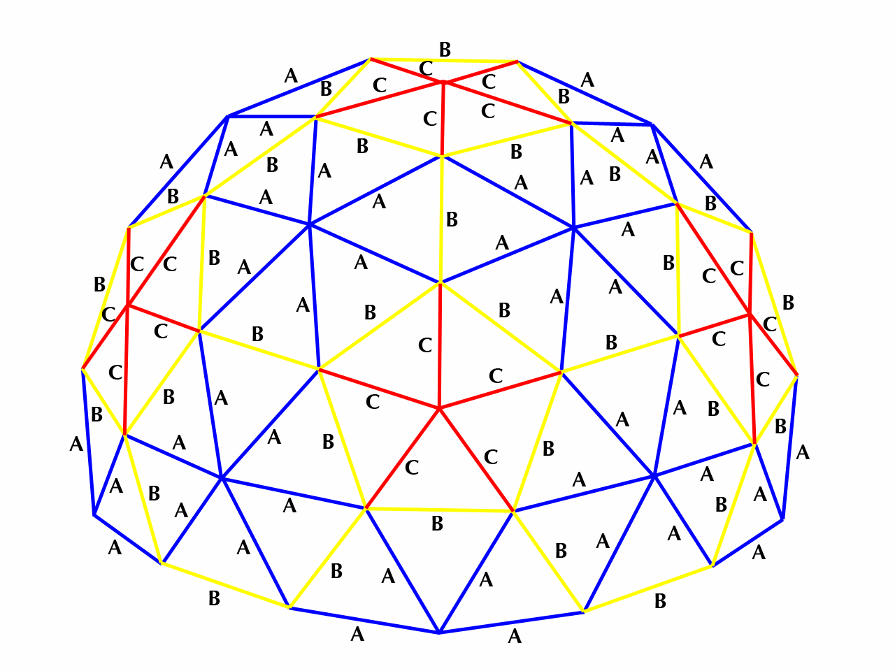

Versions
========

Triangles
---------

1. 2 layers, type ABC (bug, there is no ABC on the dome)
1. 3 layers
1. Add chamfers
4. Type: ABA (*does* exist)

Dovetails
---------

1. 100% scaling: too big. Add brim ears to ease printing. Also makes for a nice plug cover.
2. 90% scaling: almost too small
3. 93% scaling: okay
4. 95% scaling: solid once pushed in
5. Add protrusion for easier plugging and unplugging, replacing the brim ears.

Assembly
========

2023-08-{02,03} Design phase
=====

3 layers seem to be alright for the screen. Reasonably sturdy, enough transmission.

Lots of tweaking in FreeCAD.

Ordered Dotstar LED strips. Plan is to cut them into pieces, re-solder them.
Dotstar has higher frequency (better for pictures), but an additional data
cable. Around 1000 (120×8) soldering joints sounds daunting.
